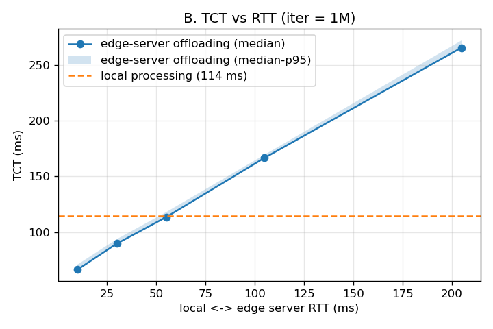

# SHA-256 워크로드: 로컬 처리 vs 엣지 서버 오프로딩

- 브랜치 `exp/uvc-sha256`, 2026-10-05
- 개요, 용어, 실행 방법은 [README.md](README.md) 참고

## 목차

1. [원본 출처](#1-원본-출처)
2. [설계](#2-설계)
3. [원본 단독 실행 (Fogify 없이)](#3-원본-단독-실행-fogify-없이)
4. [Fogify 배포 확인](#4-fogify-배포-확인)
5. [실험 결과 (노트북)](#5-실험-결과-노트북)
6. [다음 할 일](#6-다음-할-일)

---

## 1. 원본 출처

| 항목 | 내용 |
|---|---|
| 논문 | H. Dinh-Tuan, *Unikernels vs. Containers: A Runtime-Level Performance Comparison for Resource-Constrained Edge Workloads*, IEEE (arXiv:2509.07891) |
| 코드 | https://github.com/haidinhtuan/Unikernel-vs-Container, 커밋 `4e00774` |
| 라이선스 | Apache-2.0 → `examples/uvc-sha256/upstream/`에 수정 없이 복사, `NOTICE.md`에 출처 표기 |

| 원본 폴더 | 내용 | 사용 |
|---|---|---|
| `go-compute-app/` | `POST /compute?iter=N`: body를 SHA-256으로 N번 반복 해시 | ⭐ 워크로드로 사용 |
| `go-http-app/` | `GET /hello` (I/O 워크로드) | 보관만 |
| `node-*` | 같은 기능의 Node.js 버전 | 보관만 |
| 바이너리 (약 130MB), `measure_*.sh`, `*.bk` | – | ❌ 가져오지 않음 |

- 논문은 100회라고 하지만 **코드 기본값은 `iter=20000`**이다. 항상 iter를 명시한다.
- 유니커널(Nanos) 부분은 Fogify가 다루지 않으므로 제외했다. 원본은 "워크로드 출처"로만 쓴다.

## 2. 설계

### 앱 (`examples/uvc-sha256/app/`, 이미지 `uvc-sha256:0.1`)

이미지 하나에 바이너리 두 개가 들어 있다. 로컬 처리와 엣지 서버 오프로딩이 **같은 해시 함수**(`internal/work.Hash`)를 쓰므로 계산량이 정확히 같다.

| 바이너리 | 위치 | 역할 |
|---|---|---|
| `uvc-server` | 엣지 서버 | 원본과 같은 `POST /compute?iter=N`. 추가로 응답 헤더 `X-Compute-Us`(서버 계산 시간)와 `X-Server` |
| `uvc-client` | 로컬 | `idle`: 대기 (컨테이너 유지). `run`: 작업 N개를 실행하고 작업마다 CSV 한 줄을 출력 |

```bash
uvc-client run -mode local       -iter 1000000 -n 20
uvc-client run -mode edge-server -servers http://edge-server-1:8080,http://edge-server-2:8080 -iter 1000000 -n 20
```

| 옵션 | 기본값 | 설명 |
|---|---|---|
| `-mode` | `local` | `local` 또는 `edge-server` |
| `-servers` | `http://edge-server-1:8080` | 엣지 서버 목록 (쉼표로 구분, 순서대로 돌아가며 보냄) |
| `-iter` / `-payload` | 100000 / 1024 | 작업당 반복 횟수 / 요청 크기(byte) |
| `-n` / `-warmup` | 20 / 1 | 기록할 작업 수 / 기록 전에 버리는 작업 수 |
| `-interval` | 0 | 작업 사이 대기 (예: `400ms`) |
| `-keepalive` | true | false면 작업마다 새 TCP 연결 (RTT가 1번 더 붙음) |
| `-verify` | false | 돌려받은 해시 검사. **TCT 측정이 끝난 뒤에** 검사 |
| `-label` | "" | 실험 조건 태그 |

CSV 컬럼: `ts_unix_ms, label, mode, target, task, iter, payload_bytes, tct_ms, server_compute_ms, status`
→ `tct_ms − server_compute_ms` = 네트워크 + 대기 시간.

그 밖에:
- 원본의 `FROM scratch` 대신 alpine을 베이스로 쓴다. 셸이 필요하고, Fogify stress 액션용 `cpulimit`과 `stress-ng`(`stress`라는 이름으로 연결)를 넣었다.
- `/fogify/metrics`에도 정수 지표를 쓰지만, 현재는 Fogify가 수집하지 못한다 (4절).

### 토폴로지 (`examples/uvc-sha256/docker-compose.yaml`)

```
local (1코어×1043MHz → 0.5 CPU, 512M) ──edge-server-net-1 (5ms, 100Mbps)──▶ edge-server-1 (2코어×2086MHz → 2.0 CPU, 1G)
                                      └─edge-server-net-2 (5ms, 100Mbps)──▶ edge-server-2 (같은 사양)
```

| 시나리오 | 내용 |
|---|---|
| `rtt-steps` | 30초마다 edge-server-1 RTT를 30 → 55 → 105 → 10ms로 변경 |
| `bw-steps` | 30초마다 edge-server-1 대역폭을 10 → 1 → 100Mbps로 변경 |
| `edge-server-1-stress` | 30초 후 edge-server-1에 CPU 80% 부하 60초 |

## 3. 원본 단독 실행 (Fogify 없이)

원본 `go-compute-app`을 수정 없이 빌드하고 `--cpus 1 --memory 128m`(논문의 제한 조건)으로 실행했다. 랜덤 1KB body, `curl` 20회.
환경: i5-1240P (16 스레드), Linux 6.8, Docker 29.8.2.

| iter | 중앙값 | 최소 | 최대 |
|---:|---:|---:|---:|
| 100 | 0.58 ms | 0.33 | 0.86 |
| 10,000 | 1.42 ms | 1.21 | 2.31 |
| 100,000 | 7.33 ms | 6.38 | 10.04 |
| 1,000,000 | 58.58 ms | 56.94 | 67.82 |

- **iter=100은 계산이 거의 0**이다. 측정값은 루프백 HTTP 시간이다.
- 1코어에서 SHA-256 1회당 약 0.06µs다. 시간이 iter에 거의 비례한다.

Fogify용 앱으로 같은 비교를 했다 (로컬 `--cpus 0.5`, 엣지 서버 `--cpus 2`, 지연 추가 없음, n=10 중앙값):

| iter | 로컬 처리 | 엣지 서버 오프로딩 |
|---:|---:|---:|
| 100,000 | **5.8 ms** | 7.4 ms |
| 1,000,000 | 113.5 ms | **55.6 ms** |
| 3,000,000 | 397.2 ms | **164.9 ms** |

→ **CPU 제한은 할당량 방식이다** (100ms마다 50ms). 몇 ms짜리 작업은 제한에 걸리기 전에 끝나서 로컬이 오히려 빠르다. 로컬이 "느린 기기"라는 효과는 작업이 수십 ms 이상일 때부터 나타난다.

## 4. Fogify 배포 확인

| 확인 항목 | 결과 |
|---|---|
| 배포 | `deploy()` 약 10초. 로컬에서 `edge-server-1`, `edge-server-2` 이름으로 접속됨 (Swarm DNS) |
| CPU·메모리 | local `NanoCpus=0.5`, 512MiB / 엣지 서버 `2.0`, 1GiB ✅ |
| RTT | 기본 (5ms/5ms) → ping **11.0ms**. edge-server-1 쪽만 50ms로 → **55.5ms**. edge-server-2는 11.3ms 그대로 |
| TCT (iter 1M) | 로컬 111.5ms / 엣지 서버 68.7ms = 계산 57.9 + 네트워크 약 10.8 |
| stress 80% | edge-server-1 계산 56.3 → 83.6ms, TCT 67.4 → 94.3ms |
| 사용자 지표 | ❌ 수집 안 됨 |

**규칙: RTT ≈ 로컬 쪽 delay + 엣지 서버 쪽 delay.** 원하는 RTT가 R이면, 로컬 쪽을 5ms로 고정하고 엣지 서버 쪽에 `R − 5ms`를 넣는다 (노트북의 `set_link()`가 이렇게 한다).

참고 사항:
- stress 액션은 컨테이너 **안에서** `cpulimit --limit (cpus×cpu) -i -- stress --cpu N --timeout T`를 실행한다. `cpu`는 노드 CPU의 퍼센트다.
- 사용자 지표가 수집되지 않는 이유: agent가 `docker inspect`의 MergedDir(호스트 경로)를 읽는데, agent 컨테이너에 `/var/lib/docker`가 마운트되어 있지 않다.
- `undeploy()` 후에도 오버레이 네트워크(`edge-server-net-*`)는 남는다. 다음 배포 때 다시 쓰인다.
- SDK의 시나리오 실행 함수는 `scenario_execution(name)`이다. 각 액션의 `time`은 이전 액션 후 기다리는 초다.

## 5. 실험 결과 (노트북)

`examples/uvc-sha256/uvc-sha256.ipynb`, 2026-10-05 실행. 데이터와 그래프는 `examples/uvc-sha256/results/`. 기본 RTT는 약 10ms, 값은 중앙값이다.

| 실험 | 결과 |
|---|---|
| **A. 연산량** | 100k: 로컬 **6.0** vs 엣지 서버 22.0ms / 1M: 114.1 vs **66.1** / 3M: 393.9 vs **178.2** → 작은 작업은 로컬 처리, 큰 작업은 엣지 서버 오프로딩이 유리 |
| **B. RTT** ⭐ | 엣지 서버 TCT ≈ 계산 시간(약 57ms) + RTT로 직선 증가 (RTT 10 / 30 / 55 / 105 / 205 → 66 / 90 / 113 / 167 / 265ms). **RTT 약 55ms에서 로컬 처리(114ms)와 역전** |
| **C. 대역폭** (256KB) | 100Mbps 68.7 → 10Mbps 97.1 → 1Mbps 344.5ms. ⚠️ 1Mbps면 전송만 약 2초가 나와야 한다 → 엣지 서버 쪽 수신 대역폭 제한이 정확하지 않다 (확인 필요) |
| **D. 엣지 서버 부하** | 부하 80%를 건 edge-server-1: 66.1 → **93.6ms** (계산 55 → 83). 부하 없는 edge-server-2도 66.0 → 76.2ms → PC 한 대에서 CPU를 나눠 써서 부하가 조금 번진다 |
| **E. 시나리오** | RTT를 30 → 55 → 105ms로 바꾸면 TCT가 약 90 → 117 → 167ms로 바로 따라 바뀐다. ⚠️ 처음 약 18초는 D의 부하가 남아 있어서 값이 높다 |



추가로 관찰한 것:
- **로컬 처리는 흔들림이 크다.** 1M에서 중앙값 114ms, p95 171ms다. 할당량 제한 때문에 작업이 제한 구간에 걸리느냐에 따라 시간이 달라진다. 반면 엣지 서버 오프로딩은 p95가 중앙값보다 약 7ms 높을 뿐이다.
- iter 100k에서 엣지 서버 계산 시간이 11ms로, 1M 기준 비례값(약 5.5ms)보다 길다. 원인은 확인하지 않았다.

## 6. 다음 할 일

| 할 일 | 내용 |
|---|---|
| 대역폭 문제 | 로컬 쪽(송신)에도 대역폭 제한을 걸어 보고, 실험 C만 다시 실행 |
| 노트북 수정 | D가 끝난 뒤 부하가 완전히 끝날 때까지 기다리게 해서 E 앞부분 오염 막기 |
| 반복 측정 | 조건마다 n을 50~100으로 늘려 p95를 안정적으로 만들기 |
| 연구 확장 | 엣지 서버 2대의 RTT나 부하를 다르게 주고 **어느 엣지 서버로 보낼지** 비교. 로컬 CPU 사양도 바꿔가며 역전 지점 비교 |
| (선택) | Fogify agent에 `/var/lib/docker`를 마운트해서 사용자 지표 수집 살리기 |
